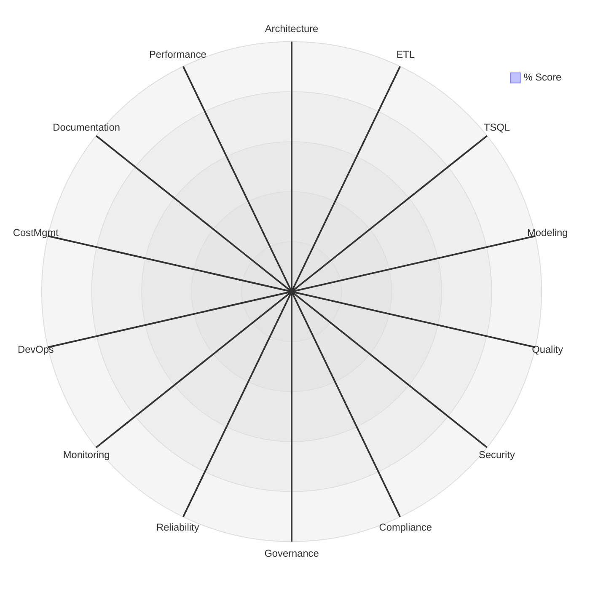

# Audit Report — MLC SQL (SQL Server / Azure SQL) Solution

> **Template**: Fill in all `[placeholder]` sections with actual findings. Delete instructional comments before delivering.

---

## Document Control

| Field | Value |
|-------|-------|
| **Client** | MLC |
| **Solution** | SQL Server / Azure SQL Data Warehouse |
| **Audit Period** | [Start Date] – [End Date] |
| **Report Date** | [Date] |
| **Auditor(s)** | [Name(s)] |
| **Report Version** | 1.0 |
| **Classification** | [Confidential / Internal / Public] |
| **Distribution** | [List of recipients] |

### Revision History

| Version | Date | Author | Changes |
|---------|------|--------|---------|
| 0.1 | | | Initial draft |
| 1.0 | | | Final report |

---

## 1. Executive Summary

### 1.1 Overall Health Score

| Metric | Value |
|--------|-------|
| **Overall Score** | **[XX.X%]** |
| **Risk Rating** | [🔴/🟠/🟡/🟢/🔵] **[Rating]** |
| **Total Checklist Items** | 328 |
| **Items Scored** | [N] |
| **Items N/A** | [N] |
| **Critical Findings** | [N] |
| **High Findings** | [N] |

### 1.2 Area Scorecard

| # | Area | Weight | Score | Weighted | Rating |
|---|------|--------|-------|----------|--------|
| 1 | Architecture & Design | 8% | | | |
| 2 | Data Integration & ETL | 10% | | | |
| 3 | T-SQL Code Quality | 8% | | | |
| 4 | Data Modeling & Storage | 9% | | | |
| 5 | Data Quality Framework | 9% | | | |
| 6 | Security & Access Control | 12% | | | |
| 7 | Compliance & Regulatory | 7% | | | |
| 8 | Data Governance | 4% | | | |
| 9 | Reliability & Resilience | 6% | | | |
| 10 | Monitoring & Observability | 5% | | | |
| 11 | DevOps & Deployment | 6% | | | |
| 12 | Cost Management & Capacity | 4% | | | |
| 13 | Documentation & Knowledge Mgmt | 3% | | | |
| 14 | Performance & Query Tuning | 9% | | | |
| | **Overall** | **100%** | | **[XX.X%]** | |

### 1.3 Radar Chart



> Replace the zeros with each area's percentage score in the axis order above.

### 1.4 Top 5 Critical Findings

| # | Finding | Area | Severity | Checklist Ref |
|---|---------|------|----------|---------------|
| 1 | | | | |
| 2 | | | | |
| 3 | | | | |
| 4 | | | | |
| 5 | | | | |

### 1.5 Top 5 Priority Recommendations

| # | Recommendation | Addresses | Effort | Risk Impact | Score Impact |
|---|---------------|-----------|--------|------------|-------------|
| 1 | | | | | |
| 2 | | | | | |
| 3 | | | | | |
| 4 | | | | | |
| 5 | | | | | |

### 1.6 Compliance Summary

> MLC compliance regime is TBD. Complete once the regime is confirmed (see Compliance Matrix Section 0).

| Control Group | Score | Rating | Key Gaps |
|--------------|-------|--------|----------|
| ITGC (SOX-style) | | | |
| Financial Data Integrity | | | |
| Audit Trail & Logging | | | |
| Data Privacy | | | |
| Regime Plug-in | TBD | TBD | |

---

## 2. Solution Overview (Discovered)

### 2.1 Architecture Diagram

> [Insert or describe: deployment model (SQL Server / Azure SQL MI / DB), staging → ODS → DW → marts, HA/DR topology, ETL tooling, and data flow directions.]

```
[Sources] → [Staging] → [ODS / Integration] → [Dimensional DW] → [Data Marts] → [Reporting]
                 (ETL: SSIS / ADF / T-SQL)              HA/DR: [AG / failover group / zone-redundant]
```

### 2.2 Instance / Database Inventory

| Server / Instance | Deployment Model | Service Tier | Databases | Notes |
|-------------------|------------------|--------------|-----------|-------|
| | | | | |

### 2.3 Schema / Layer Summary

| Layer | Schema(s) | Tables | Size | Key Characteristics |
|-------|-----------|--------|------|---------------------|
| Staging | | | | |
| ODS / Integration | | | | |
| Dimensional DW | | | | |
| Data Marts | | | | |

### 2.4 ETL Inventory

| ETL Object | Tool | Source → Target | Schedule | Load Type | Owner |
|-----------|------|-----------------|----------|-----------|-------|
| | | | | | |

---

## 3. Detailed Findings by Area

> Repeat this structure for all 14 areas. Full checklist scores are in [02-audit-checklist.md](02-audit-checklist.md).

### 3.[N] Area [N]: [Area Name]

**Area Score: [XX.X%] | Rating: [icon] [Rating]**

| Category | Score | Rating |
|----------|-------|--------|
| [Category] | | |

#### Findings

| # | Checklist Ref | Finding | Severity | Score |
|---|--------------|---------|----------|-------|
| 1 | | | | |

#### Recommendations

| # | Recommendation | Addresses | Effort | Risk Impact | Score Impact |
|---|---------------|-----------|--------|------------|-------------|
| 1 | | | | | |

---

## 4. Consolidated Recommendations Roadmap

| Priority | Recommendation | Area(s) | Effort | Severity Addressed | Target Window |
|----------|---------------|---------|--------|--------------------|---------------|
| 1 | | | | | 0–7 days |
| 2 | | | | | 30 days |
| 3 | | | | | 90 days |

---

## 5. Appendices

- **Appendix A**: Full checklist scores — [02-audit-checklist.md](02-audit-checklist.md)
- **Appendix B**: Compliance matrix — [03-compliance-matrix.md](03-compliance-matrix.md)
- **Appendix C**: Risk register — [06-risk-register-template.md](06-risk-register-template.md)
- **Appendix D**: Evidence index — [DMV outputs, execution plans, config exports collected]
- **Appendix D**: Evidence index — [DMV outputs, execution plans, config exports collected]

