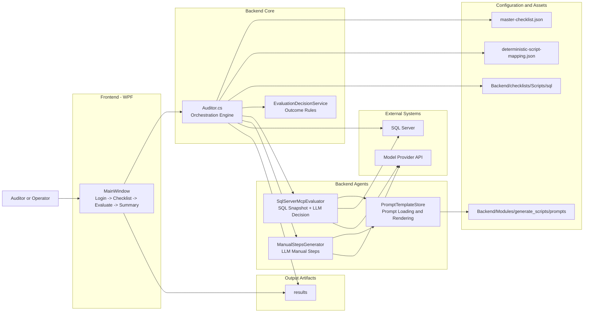
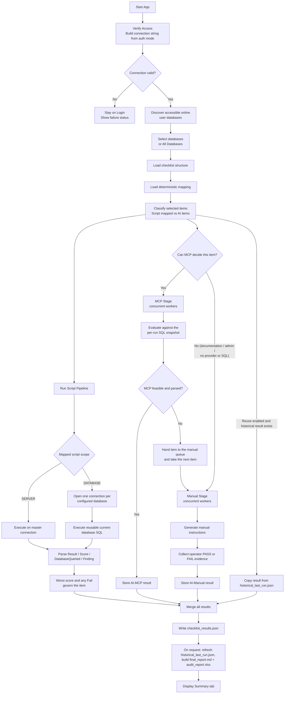

# SQL Auditing Tool - High Level Architecture

## Purpose

The SQL Auditing Tool evaluates SQL environment compliance against a checklist using three techniques:

- Script: deterministic SQL scripts from mapping.
- AI-MCP: AI evaluation using SQL metadata snapshot and model prompts.
- AI-Manual: manual operator validation with AI-generated instructions.

Primary outputs are grouped by audit run under
`results/<yyyyMMdd_HHmmss_fff>_<sanitized-server-name>/`:

- `checklist_results.json`
- `historical_last_run.json`
- `final_report.md`
- `audit_report.xlsx`
- `progress_stream.txt`
- `ui_log.txt`

## Architectural Overview



## Runtime Flow (End-to-End)



## Evaluation Decision Logic

1. Script technique
- Used when checklist item has mapped script(s).
- `SERVER` scripts execute on the shared master connection. `DATABASE` scripts execute once per
  configured user database, using `InitialCatalog`; selected names are never inserted into SQL.
- Legacy database scripts that enumerate `sys.databases` receive a session-local filtered catalog
  containing only the current target. Newly generated scripts query only current-database catalogs.
- Captures the final structured `Result`, `Score`, `DatabaseQueried`, and `Finding` row. Across
  database executions, the minimum score wins and any `Fail` makes the item fail.

2. AI-MCP technique
- Used for unmapped items when SQL connectivity is available.
- Reads the per-run SQL snapshot (server metadata + user DB summaries). The snapshot describes the
  server rather than the checklist item, so it is collected once per run and shared by every item.
- Sends prompt to model provider and parses structured response.
- If response is feasible and parseable, uses AI-MCP result.
- An item it cannot decide is handed to the manual stage; the worker immediately takes the next item.
- If the snapshot holds no supporting artefact for the item (every relevant value irrelevant,
  NULL, empty or zero), the control does not exist to be assessed: the evidence opens with
  `Not Applicable.` and the outcome is `Not Applicable`, which is excluded from all scoring.

3. AI-Manual technique
- Fallback when MCP is unavailable, infeasible, or when no SQL connection.
- Generates manual verification steps (LLM first, static prompt fallback).
- Operator provides PASS/FAIL or notes; result is persisted.

## Evaluation Concurrency

The script pipeline, the MCP stage and the manual stage all run at the same time, so no stage waits
for another to finish:

- MCP evaluation and manual-step generation are separate provider calls joined by an unbounded
  queue. Deferring an item costs the MCP stage nothing, and manual guidance for already-deferred
  items is written while later items are still being evaluated.
- Documentation and admin checks never qualify for MCP, so they reach the manual stage immediately
  instead of waiting behind MCP evaluations.
- Each stage processes several items at once (`Auditor.MaxAiStageWorkers`). Every MCP worker owns
  its SQL connection, because one connection cannot serve concurrent evaluations.
- The manual stage runs single-threaded when the host collects operator input inline, so the
  reviewer is still prompted for one item at a time.
- The queue is closed only after every MCP worker stops producing, so no deferred item is lost and
  no manual worker waits forever.

Ordering is not part of the contract: each item still produces exactly one result, and scoring reads
the merged results rather than their arrival order.

## Script Generation

- `ChecklistItemProcessor` asks the configured model to classify feasibility, script type, and
  `SERVER` or `DATABASE` scope, then generate the read-only four-column contract.
- `ScriptOutputValidator` applies the deterministic format gate; the C1-C7 review can return a
  complete corrected script before save.
- `ScriptGeneratorAgent` and `ScriptGenerationSkill` save the script and its scope in
  `deterministic-script-mapping.json`.
- A `DATABASE` script is generated for `DB_NAME()` only. Runtime database selection belongs to
  `Auditor`, which keeps scripts reusable across different audit runs.

## Scoring and Reports

- A script's score is factual input from its final result row. Database fan-out does not rescore
  it; `SqlScriptResultParser` selects the minimum returned score (0-3).
- Category score is `sum(item scores) / (scored items * 3)`. Area score is the average of its
  scored category percentages. Overall score is the weighted average of scored areas, with weights
  renormalized when an area has no scored items.
- Not Applicable items have no score and are excluded at item, category, area, and overall levels.
- `checklist_results.json` is the persisted source for both reports. `SummaryReportGenerator`
  writes `final_report.md`; `ExcelReportGenerator` uses the same `ScoreCalculator` and writes
  `audit_report.xlsx` with Summary, Area Detail, Checklists, Risk Register, and Not Applicable
  Items sheets.

## Main Modules and Responsibilities

- `Backend/Application/core/Auditor.cs`
  - Core orchestrator for checklist loading, pipeline execution, and result persistence.
  - Normalizes SQL connection variants, discovers user databases, routes scripts by scope, and
    coordinates Script/AI flows.

- `Backend/Modules/show_results/SummaryReportGenerator.cs` and `ExcelReportGenerator.cs`
  - Share the score calculator and render Markdown and Excel from persisted checklist results.

- `Backend/Modules/evaluate/AI-MCP/SqlServerMcpEvaluator.cs`
  - Collects SQL snapshot and performs model-based evaluation for AI-MCP.
  - Handles provider call, response parsing, and feasibility checks.

- `Backend/Modules/evaluate/AI-Manual/ManualStepsGenerator.cs`
  - Generates actionable manual validation steps for AI-Manual workflow.

- `Backend/Modules/evaluate/EvaluationDecisionService.cs`
  - Applies deterministic outcome rules over evidence.

- `Backend/Application/core/PromptTemplateStore.cs`
  - Resolves and renders prompt templates. Each prompt lives with the module that owns it, so
    lookup searches the per-module `prompts/` folders.

- `Backend/Modules/evaluate/AI-Manual/HistoricalManualResultsStore.cs`
  - Reads/writes `results/historical_last_run.json` (manual and AI-Manual results keyed by
    checklist ID) so completed manual evaluations can be reused by a later run.
  - Refreshed only at report generation; shared by WPF, CLI and IDE/MCP.

- `Frontend/MainWindow/MainWindow.xaml(.cs)`
  - Implements staged UX and user-driven evaluation lifecycle.
  - Handles checklist selection, manual evidence capture, and summary rendering.

## Repository Layout

```text
Backend/
  Application/core/   Auditor, AuditOutputPaths, provider + prompt infrastructure, SQLAuditor.Lib
  Modules/
    evaluate/         shared outcome rules and result enrichment
      Script/         deterministic SQL execution, result parsing, script enrichment
      AI-MCP/         snapshot-based model evaluation
      AI-Manual/      manual guidance, manual enrichment, historical reuse
    generate_scripts/ generation pipeline, models, prompts, authoring tools
    configure_checklist/ custom checklist items: store, AI agent, pipeline, prompts
    show_results/     Markdown and Excel report generation
  CLI/                console host (SQLAuditor.exe) and sql-auditor.ps1 launcher
  IDE/                MCP server plus one SKILL.md per tool
  checklists/         master checklist, deterministic mapping, Scripts/{sql,ps1}
Frontend/MainWindow/  WPF desktop host
```

Each feature module owns its own `prompts/` folder. The three host projects (`CLI`, `IDE`,
`Frontend`) reference `Backend/Application/core/SQLAuditor.Lib.csproj`, which compiles
`Backend/Modules/**`, so a module has exactly one implementation and one owner.

## Data and File Boundaries

- Checklist definition (merged runtime file): `Backend/checklists/master-checklist.json`.
- Deterministic mapping (merged runtime file): `Backend/checklists/deterministic-script-mapping.json`.
- Both merged files are generated by `ChecklistConfigurationStore` and are never edited by hand:
  - `master-checklist.json` = `default-checklist.json` + `custom-checklist.json`
  - `deterministic-script-mapping.json` = `default-deterministic-script-mapping.json`
    + `custom-deterministic-script-mapping.json`
  - The `default-*` files are seeded once from the shipped runtime files and are the only home for
    default checklist data. The Configure Checklist flow never modifies them.
  - `custom-checklist-pending.json` holds reserved-but-unapproved drafts; entries are removed on
    approval or rejection, so nothing unapproved reaches the custom configuration.
- Runtime database selection: in-memory only; WPF passes selected names to `Auditor`. It is not
  written into scripts, mappings, result files, or provider configuration.
- SQL script assets: `Backend/checklists/Scripts/sql/`.
- Prompt templates: `prompts/` inside each owning module.
- Runtime artifacts: `results/`.

## Custom Checklist Configuration

Custom checks are added under an EXISTING Area/Sub-area only; new Areas/Sub-areas are not
supported. The pipeline is identical in every host:

```
Custom Checklist -> Guardrails -> Semantic Match Router -> Area/Sub-area Classification
-> Script & Logic Generator -> User Verification -> custom-checklist.json
-> custom-deterministic-script-mapping.json -> Merge Final Configuration
```

- `CustomChecklistSkill` owns the deterministic stages, the canonical prompt templates
  (`custom_checklist_guardrails_*`, `custom_checklist_match_*`, `custom_checklist_classify_*`) and
  the shortlist of nearest existing items the match router reasons over.
- `ChecklistConfigurationStore` allocates the next free ID inside the chosen sub-area under a
  named mutex, so concurrent additions can never collide, and regenerates the merged files.
- Script generation reuses `ChecklistItemProcessor`, `ScriptOutputValidator` and the existing
  `script_generator_*` / `script_validation_*` prompts unchanged.
- WPF drives the AI stages through the configured provider (`CustomChecklistAiAgent` +
  `CustomChecklistPipeline`, surfaced by `ConfigureChecklistWindow` and
  `CustomChecklistProgressWindow`). The CLI (`sqlauditor configure_checklist`) and the MCP server
  (`configure_checklist` tool) use `CustomChecklistHostFlow`, where Copilot is the AI layer and
  follows the same templates.
- Approved custom items participate in the existing Script / AI-MCP / AI-Manual pipelines,
  scoring, historical manual results, reporting and export with no special-casing.

## Deployment/Execution Modes

- Console mode (`Backend/CLI/Program.cs`): interactive CLI for script and checklist evaluation.
- Desktop mode (`Frontend/MainWindow/SQLAuditor.Wpf.csproj`): guided, staged execution with manual queue and summary UX.
