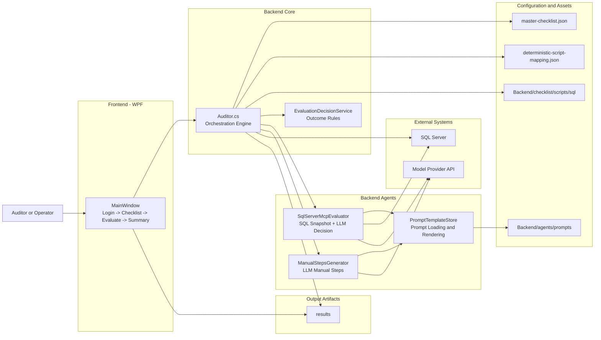
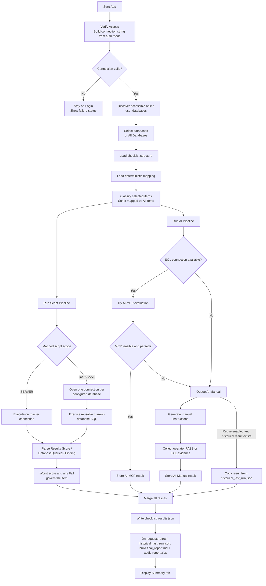

# SQL Auditing Tool - High Level Architecture

## Purpose

The SQL Auditing Tool evaluates SQL environment compliance against a checklist using three techniques:

- Script: deterministic SQL scripts from mapping.
- AI-MCP: AI evaluation using SQL metadata snapshot and model prompts.
- AI-Manual: manual operator validation with AI-generated instructions.

Primary outputs are written to the `results/` folder:

- `checklist_results.json`
- `historical_last_run.json`
- `final_report.md`
- `audit_report.xlsx`
- `progress_stream.txt`
- `ui_log.txt`

## Architectural Overview

## Runtime Flow (End-to-End)

## Evaluation Decision Logic

1. Script technique
- Used when checklist item has mapped script(s).
- `SERVER` scripts execute on the shared master connection. `DATABASE` scripts execute once per
  configured user database, using `InitialCatalog`; selected names are never inserted into SQL.
- Legacy database scripts that enumerate `sys.databases` receive a session-local filtered catalog
  containing only the current target. Newly generated scripts query only current-database catalogs.
- Captures the final structured `Result`, `Score`, `DatabaseQueried`, and `Finding` row. Across
  database executions, the minimum score wins and any `Fail` makes the item fail.

2. AI-MCP technique
- Used for unmapped items when SQL connectivity is available.
- Builds SQL snapshot (server metadata + user DB summaries).
- Sends prompt to model provider and parses structured response.
- If response is feasible and parseable, uses AI-MCP result.

3. AI-Manual technique
- Fallback when MCP is unavailable, infeasible, or when no SQL connection.
- Generates manual verification steps (LLM first, static prompt fallback).
- Operator provides PASS/FAIL or notes; result is persisted.

## Script Generation

- `ChecklistItemProcessor` asks the configured model to classify feasibility, script type, and
  `SERVER` or `DATABASE` scope, then generate the read-only four-column contract.
- `ScriptOutputValidator` applies the deterministic format gate; the C1-C7 review can return a
  complete corrected script before save.
- `ScriptGeneratorAgent` and `ScriptGenerationSkill` save the script and its scope in
  `deterministic-script-mapping.json`.
- A `DATABASE` script is generated for `DB_NAME()` only. Runtime database selection belongs to
  `Auditor`, which keeps scripts reusable across different audit runs.

## Scoring and Reports

- A script's score is factual input from its final result row. Database fan-out does not rescore
  it; `SqlScriptResultParser` selects the minimum returned score (0-3).
- Category score is `sum(item scores) / (scored items * 3)`. Area score is the average of its
  scored category percentages. Overall score is the weighted average of scored areas, with weights
  renormalized when an area has no scored items.
- Not Applicable items have no score and are excluded at item, category, area, and overall levels.
- `checklist_results.json` is the persisted source for both reports. `SummaryReportGenerator`
  writes `final_report.md`; `ExcelReportGenerator` uses the same `ScoreCalculator` and writes
  `audit_report.xlsx` with Summary, Area Detail, Checklists, Risk Register, and Not Applicable
  Items sheets.

## Main Modules and Responsibilities

- `Backend/core/Auditor.cs`
  - Core orchestrator for checklist loading, pipeline execution, and result persistence.
  - Normalizes SQL connection variants, discovers user databases, routes scripts by scope, and
    coordinates Script/AI flows.

- `Backend/agents/modules/reporting/SummaryReportGenerator.cs` and `ExcelReportGenerator.cs`
  - Share the score calculator and render Markdown and Excel from persisted checklist results.

- `Backend/agents/modules/SqlServerMcpEvaluator.cs`
  - Collects SQL snapshot and performs model-based evaluation for AI-MCP.
  - Handles provider call, response parsing, and feasibility checks.

- `Backend/agents/modules/ManualStepsGenerator.cs`
  - Generates actionable manual validation steps for AI-Manual workflow.

- `Backend/agents/modules/EvaluationDecisionService.cs`
  - Applies deterministic outcome rules over evidence.

- `Backend/agents/modules/PromptTemplateStore.cs`
  - Resolves and renders prompt templates from `Backend/agents/prompts/`.

- `Backend/agents/modules/application/HistoricalManualResultsStore.cs`
  - Reads/writes `results/historical_last_run.json` (manual and AI-Manual results keyed by
    checklist ID) so completed manual evaluations can be reused by a later run.
  - Refreshed only at report generation; shared by WPF, CLI and IDE/MCP.

- `Frontend/MainWindow/MainWindow.xaml(.cs)`
  - Implements staged UX and user-driven evaluation lifecycle.
  - Handles checklist selection, manual evidence capture, and summary rendering.

## Data and File Boundaries

- Checklist definition: `Backend/checklist/master-checklist.json`.
- Deterministic mapping: `Backend/checklist/deterministic-script-mapping.json`.
- Runtime database selection: in-memory only; WPF passes selected names to `Auditor`. It is not
  written into scripts, mappings, result files, or provider configuration.
- SQL script assets: `Backend/checklist/scripts/sql/`.
- Prompt templates: `Backend/agents/prompts/`.
- Runtime artifacts: `results/`.

## Deployment/Execution Modes

- Console mode (`Backend/core/Program.cs`): interactive CLI for script and checklist evaluation.
- Desktop mode (`Frontend/MainWindow/SQLAuditor.Wpf.csproj`): guided, staged execution with manual queue and summary UX.
