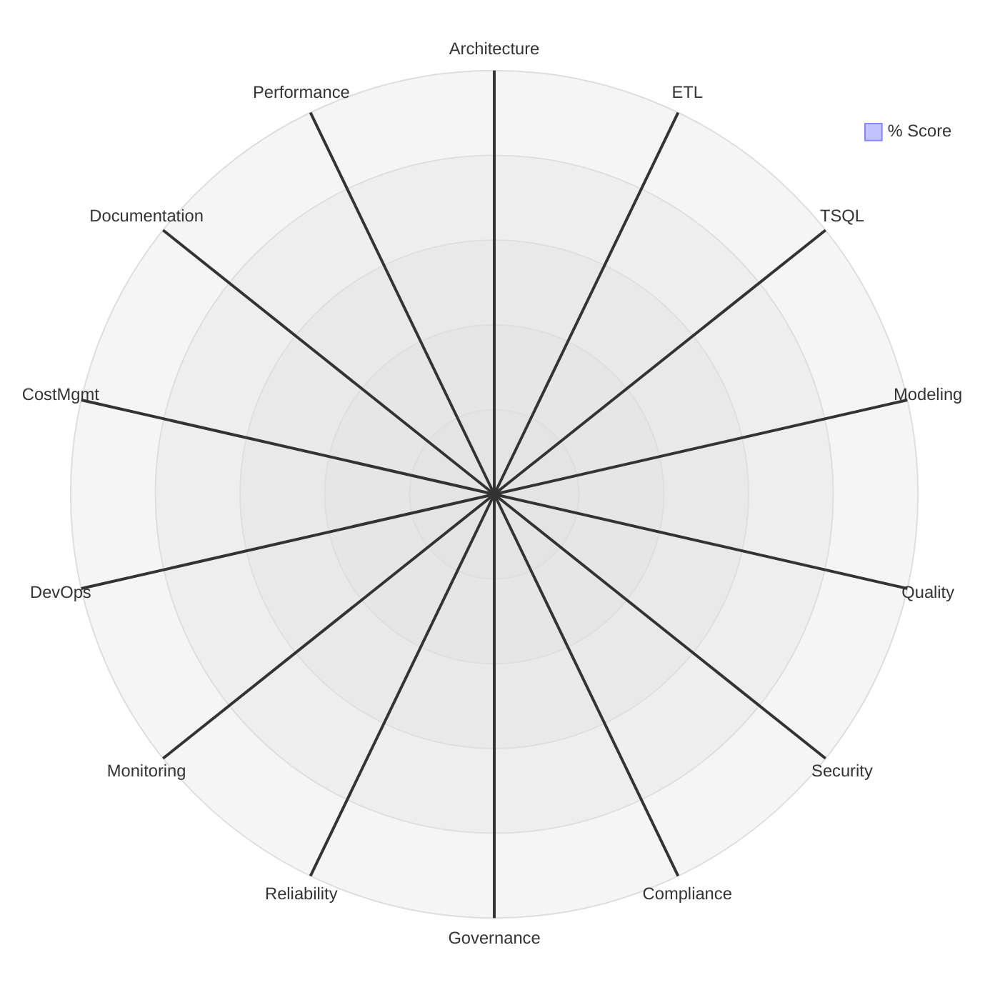

# Audit Report — MLC SQL (SQL Server / Azure SQL) Solution

---

## Document Control

| Field | Value |
|-------|-------|
| **Client** | MLC |
| **Solution** | SQL Server / Azure SQL Data Warehouse |
| **Audit Period** | [Start Date] – [End Date] |
| **Report Date** | 2026-08-10 |
| **Auditor(s)** | SQL Auditor Tool (automated) |
| **Report Version** | 1.0 |
| **Classification** | Confidential |
| **Distribution** | [List of recipients] |

### Revision History

| Version | Date | Author | Changes |
|---------|------|--------|---------|
| 0.1 | | | Initial draft |
| 1.0 | 2026-08-10 | SQL Auditor Tool (automated) | Final report |

---

## 1. Executive Summary

### 1.1 Overall Health Score

| Metric | Value |
|--------|-------|
| **Overall Score** | **0.0%** |
| **Risk Rating** | 🔴 **Critical** |
| **Total Checklist Items** | 1 |
| **Items Scored** | 1 |
| **Items N/A** | 0 |
| **Critical Findings** | 1 |
| **High Findings** | 0 |

### 1.2 Area Scorecard

| # | Area | Weight | Score | Weighted | Rating |
|---|------|--------|-------|----------|--------|
| 1 | Architecture & Design | 8% | 0.0% | 0.0 | 🔴 Critical |
| 2 | Data Integration & ETL | 10% | N/A | — | — |
| 3 | T-SQL Code Quality | 8% | N/A | — | — |
| 4 | Data Modeling & Storage | 9% | N/A | — | — |
| 5 | Data Quality Framework | 9% | N/A | — | — |
| 6 | Security & Access Control | 12% | N/A | — | — |
| 7 | Compliance & Regulatory | 7% | N/A | — | — |
| 8 | Data Governance | 4% | N/A | — | — |
| 9 | Reliability & Resilience | 6% | N/A | — | — |
| 10 | Monitoring & Observability | 5% | N/A | — | — |
| 11 | DevOps & Deployment | 6% | N/A | — | — |
| 12 | Cost Management & Capacity | 4% | N/A | — | — |
| 13 | Documentation & Knowledge Mgmt | 3% | N/A | — | — |
| 14 | Performance & Query Tuning | 9% | N/A | — | — |
| | **Overall** | **100%** | | **0.0%** | 🔴 Critical |

### 1.3 Radar Chart

### 1.4 Top 5 Critical Findings

| # | Finding | Area | Severity | Checklist Ref |
|---|---------|------|----------|---------------|
| 1 | Deployment model is identified as SQL Server Express on a local Windows 10 machine, but lacks required documentation and rationale. | 1. Architecture & Design | Medium | 1.1.1 |

### 1.5 Top 5 Priority Recommendations

| # | Recommendation | Addresses | Effort | Risk Impact | Score Impact |
|---|---------------|-----------|--------|------------|-------------|
| 1 | Create and maintain formal documentation detailing the deployment model and the business/technical rationale for its selection. | 1.1.1 | Low | Unmanaged deployment choices increase configuration drift and compliance risks. | +3 pts |

---

## 2. Detailed Findings by Area

> Areas with no assessed items are omitted. Full checklist scores are in [02-audit-checklist.md](02-audit-checklist.md).

### 2.1 Area 1: Architecture & Design

**Area Score: 0.0% | Rating: 🔴 Critical**

| Category | Score | Rating |
|----------|-------|--------|
| 1.1 | 0.0% | 🔴 Critical |

#### Findings

| # | Checklist Ref | Finding | Severity | Score |
|---|--------------|---------|----------|-------|
| 1 | 1.1.1 | Deployment model is identified as SQL Server Express on a local Windows 10 machine, but lacks required documentation and rationale. | Medium | 0 |

#### Recommendations

| # | Recommendation | Addresses | Effort | Risk Impact | Score Impact |
|---|---------------|-----------|--------|------------|-------------|
| 1 | Create and maintain formal documentation detailing the deployment model and the business/technical rationale for its selection. | 1.1.1 | Low | Unmanaged deployment choices increase configuration drift and compliance risks. | +3 pts |

---

## 3. Consolidated Recommendations Roadmap

| Priority | Recommendation | Area(s) | Effort | Severity Addressed | Target Window |
|----------|---------------|---------|--------|--------------------|---------------|
| 1 | Create and maintain formal documentation detailing the deployment model and the business/technical rationale for its selection. | 1. Architecture & Design | Low | Medium | 0–7 days |

---

## 4. Appendices

- **Appendix A**: Full checklist scores — [02-audit-checklist.md](02-audit-checklist.md)
- **Appendix B**: Compliance matrix — [03-compliance-matrix.md](03-compliance-matrix.md)
- **Appendix C**: Risk register — [06-risk-register-template.md](06-risk-register-template.md)
- **Appendix D**: Evidence index — [DMV outputs, execution plans, config exports collected]

