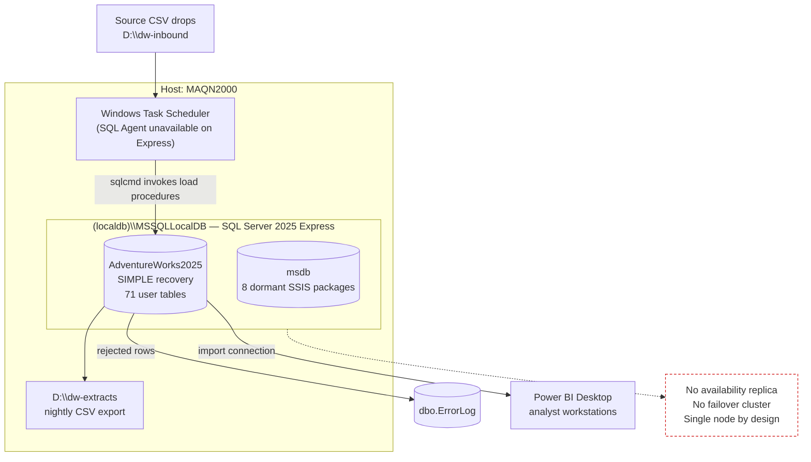

# Architecture Diagram — AdventureWorks Data Platform

| Field | Value |
| --- | --- |
| Document version | 4.0 |
| Status | **Approved** |
| Approved by | Architecture Review Board, record ARB-2026-014 |
| Last reviewed | 2026-09-02 |
| Verified against the deployed instance | 2026-09-02 by P. Raman |
| Owner | Priya Raman, Data Platform Engineering |

## 1. Current-state diagram

This diagram describes the instance `(localdb)\MSSQLLocalDB` on host `MAQN2000` as actually
deployed. It is not a target-state or aspirational design.

## 2. What the diagram asserts

| Assertion | Verified how |
| --- | --- |
| One instance, one user database | `sys.databases` — one non-system database, `AdventureWorks2025` |
| No HA components | `IsHadrEnabled = 0`, `IsClustered = 0`, 0 availability replicas |
| No SQL Agent scheduling | Express edition; 0 Agent jobs present |
| Rejected rows land in `dbo.ErrorLog` | Table present, written to by 10 programmable modules |
| Export path `D:\dw-extracts` | Confirmed on the host filesystem |

## 3. Deliberate omissions

The diagram shows **no** load balancer, listener, replica or gateway because none exists. The
single-node shape is the decision recorded in
[deployment-model.md](deployment-model.md) section 2, not an incomplete drawing.

## 4. Currency

Re-verified against the live instance on 2026-09-02, after the SQL Server 2025 engine upgrade. The
next verification is due with the quarterly topology review.

## 5. Change history

| Version | Date | Change |
| --- | --- | --- |
| 4.0 | 2026-09-02 | Redrawn for SQL Server 2025; added the verification table |
| 3.2 | 2026-05-14 | Added the error-routing path to `dbo.ErrorLog` |
