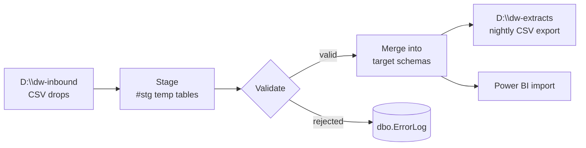

# ETL Design — AdventureWorks Data Platform

| Field | Value |
| --- | --- |
| Document version | 2.9 |
| Status | **Approved** |
| Approved by | Data Platform Engineering, change record CHG-2026-0447 |
| Last reviewed | 2026-09-04 |
| Owner | Adaeze Whitfield, Data Engineering |
| Review cadence | Quarterly, and on any change to the load |

## 1. Scope

Describes the load into `AdventureWorks2025` on `(localdb)\MSSQLLocalDB`. Source-to-target column
detail is held in [source-to-target-mapping.md](source-to-target-mapping.md).

## 2. Orchestration

SQL Server Agent is **not available** on Express, so the load is driven externally:

| Component | Detail |
| --- | --- |
| Trigger | Windows Task Scheduler task `AW-Nightly-Load` on host `MAQN2000` |
| Schedule | 02:15 local, daily |
| Runner | `sqlcmd` invoking `dbo.usp_RunNightlyLoad` |
| Log | `D:\dw-logs\nightly-load-{yyyyMMdd}.log` |

The 8 SSIS packages remaining in `msdb` are **dormant legacy artefacts** from the previous platform.
They are not executed by any schedule and are tracked for removal under CHG-2026-0451.

## 3. Data flow

| Stage | What happens |
| --- | --- |
| 1. Land | Upstream systems drop CSV files into `D:\dw-inbound` before 02:00 |
| 2. Stage | Each file is bulk-loaded into a session-scoped `#stg_*` temp table |
| 3. Validate | Type, null and referential checks; failures are written to `dbo.ErrorLog` with `ErrorCode`, `ErrorColumn`, `ErrorMessage` |
| 4. Transform | Applied in the merge statements — see section 4 |
| 5. Load | Set-based `MERGE` into the target schema table |
| 6. Publish | Nightly CSV export to `D:\dw-extracts`; analysts import into Power BI |

## 4. Transformations applied

| Transformation | Where | Rule |
| --- | --- | --- |
| Currency normalisation | `Sales.CurrencyRate` | All monetary values converted to USD using the rate effective on `OrderDate` |
| Name standardisation | `Person.Person` | Trim, collapse internal whitespace, title-case `FirstName` / `LastName` |
| Address deduplication | `Person.Address` | Match on `AddressLine1` + `PostalCode`; keep the earliest `rowguid` |
| Product status derivation | `Production.Product` | `SellEndDate IS NULL` → active, else discontinued |
| Order total recalculation | `Sales.SalesOrderHeader` | `SubTotal` recomputed from detail lines rather than trusting the source |
| Soft-delete handling | all target tables | Source absence does **not** delete; removals arrive as an explicit delete feed |

## 5. Known design limitations

Recorded honestly so they are not mistaken for oversights:

- Staging uses **temp tables**, so no staging rows survive a failed run for inspection.
- There is **no persisted watermark table**; the load is a full compare each night. At this data
  volume (71 tables, under 1 GB) a full compare completes in under 4 minutes, so incremental
  loading has not been justified.
- Restart is **whole-run only** — a failure re-runs the entire load rather than resuming.

## 6. Change history

| Version | Date | Change |
| --- | --- | --- |
| 2.9 | 2026-09-04 | Documented the dormant msdb packages and the external scheduler |
| 2.7 | 2026-06-22 | Added the soft-delete rule |
| 2.5 | 2026-03-18 | Rewrote the data-flow diagram after moving off SSIS |
