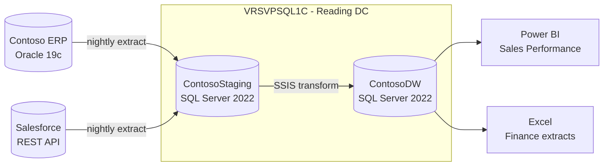

# Architecture Overview — Contoso Data Warehouse

**Version:** 3.1
**Last reviewed:** 2026-08-28
**Owner:** Data Platform Team (data-platform@contoso.example)
**Approved by:** M. Okafor, Head of Data Engineering — 2026-08-28

## 1. Deployment model and rationale

The platform runs on **SQL Server 2022 Enterprise Edition, installed on-premises** on
`VRSVPSQL1C` in the Reading datacentre. It is **not** Azure SQL Managed Instance and **not**
Azure SQL Database.

This was a deliberate decision recorded at design review DR-2024-017 on 2024-11-06. The rationale:

| Option considered | Outcome | Reason |
|-------------------|---------|--------|
| Azure SQL Database | Rejected | The nightly load uses cross-database queries against `ContosoStaging` and SQL Agent jobs; neither is supported on a single database. |
| Azure SQL Managed Instance | Rejected | Contoso's data residency policy (DP-14) requires sales data to remain on premises until the 2027 cloud programme completes. |
| SQL Server on an Azure VM | Rejected | Would incur egress charges against the on-premises ERP source without removing the residency constraint. |
| **SQL Server 2022 on-premises** | **Selected** | Meets the residency constraint, supports cross-database ETL and SQL Agent, and reuses the existing datacentre licence agreement. |

The decision is reviewed annually. Next review: 2027-08.

## 2. Architecture diagram

The diagram below reflects the implementation as deployed on 2026-08-28.

All components shown above exist in production. No component in the diagram is planned or
aspirational.

## 3. Component inventory

| Component | Technology | Purpose |
|-----------|------------|---------|
| `VRSVPSQL1C` | SQL Server 2022 Enterprise (16.0.4150.1) | Hosts both staging and warehouse databases |
| `ContosoStaging` | SQL Server database | Landing zone for raw extracts |
| `ContosoDW` | SQL Server database | Conformed dimensional model |
| `CONTOSO-SSIS01` | SQL Server Integration Services 2022 | Runs the nightly transform packages |
| Power BI Premium | P1 capacity | Consumes `ContosoDW` via DirectQuery |

## 4. Scale approach

The platform scales **up**, not out. The instance is sized for the peak nightly load window
(01:00–04:00). There are no read replicas and no elastic pools; a single instance serves both
the load and the reporting workload. Growth is reviewed at the annual design review.
