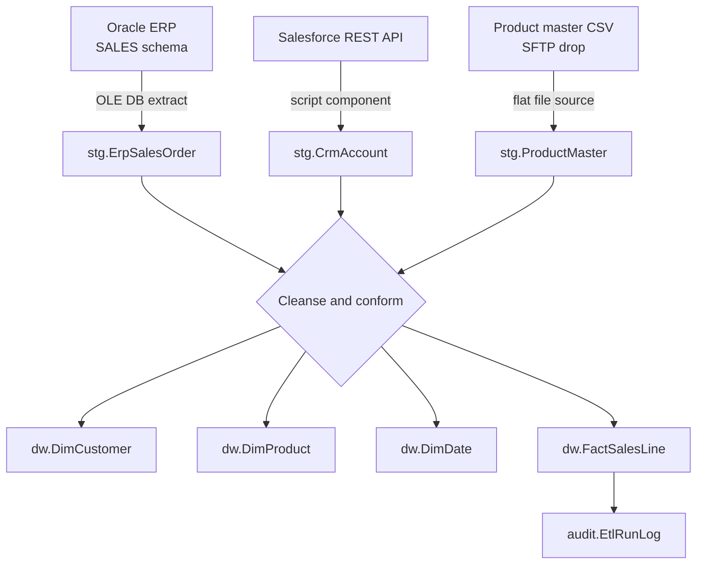

# ETL Design — Contoso Data Warehouse

**Version:** 4.0
**Last reviewed:** 2026-08-21
**Owner:** Data Engineering (data-eng@contoso.example)

## 1. Data flow

## 2. Packages and schedule

| Package | Schedule | Source | Target |
|---------|----------|--------|--------|
| `01_Extract_Erp.dtsx` | 01:00 daily | Oracle ERP `SALES` schema | `ContosoStaging.stg.ErpSalesOrder` |
| `02_Extract_Crm.dtsx` | 01:00 daily | Salesforce REST API | `ContosoStaging.stg.CrmAccount` |
| `03_Extract_Product.dtsx` | 01:15 daily | SFTP flat file | `ContosoStaging.stg.ProductMaster` |
| `10_Load_Dimensions.dtsx` | 02:00 daily | `ContosoStaging.stg.*` | `ContosoDW.dw.Dim*` |
| `20_Load_Facts.dtsx` | 02:30 daily | `ContosoStaging.stg.ErpSalesOrder` | `ContosoDW.dw.FactSalesLine` |
| `99_Audit_Close.dtsx` | 04:00 daily | run context | `ContosoAudit.audit.EtlRunLog` |

Packages are orchestrated by the SQL Agent job `Contoso DW Nightly Load`. Each step is configured
to fail the job on error; there is no continue-on-error step.

## 3. Transformation logic

### 3.1 Customer conforming (`10_Load_Dimensions.dtsx`)

ERP customers and Salesforce accounts are matched on `TaxRegistrationNumber`, falling back to a
normalised `(CompanyName, PostalCode)` match. Where both sources supply a value, **ERP wins** for
legal name and billing address; **Salesforce wins** for industry classification and account owner.

`dw.DimCustomer` is a **Type 2 slowly changing dimension** on billing country and industry
classification. All other attribute changes overwrite in place (Type 1).

### 3.2 Product conforming

`dw.DimProduct` is **Type 1**. Discontinued products are retained with `IsActive = 0` so historical
facts continue to resolve.

### 3.3 Currency normalisation (`20_Load_Facts.dtsx`)

All monetary amounts are converted to GBP using the daily ECB rate captured in
`stg.ExchangeRate`. The source amount and source currency are retained alongside the converted
value so the conversion is reproducible.

### 3.4 Late-arriving dimensions

If a fact row references a customer or product not yet present in the dimension, an inferred member
is created with the business key and `IsInferred = 1`. The next dimension load resolves it.

## 4. Error handling

Rows failing validation are redirected to `stg.RejectedRow` with the failing rule name and the
package execution ID. The nightly run fails if the reject count exceeds 0.5% of the batch.

## 5. Naming conventions

| Object | Convention | Example |
|--------|------------|---------|
| Package | `NN_Verb_Subject.dtsx`, NN sets the execution order | `20_Load_Facts.dtsx` |
| Staging table | `stg.<Source><Entity>` | `stg.ErpSalesOrder` |
| Dimension | `dw.Dim<Entity>` | `dw.DimCustomer` |
| Fact | `dw.Fact<Entity>` | `dw.FactSalesLine` |
| Agent job | `Contoso DW <Purpose>` | `Contoso DW Nightly Load` |

The conventions above are applied to every package and table currently in the solution.

## 6. Related documents

- [source-to-target-mapping.md](source-to-target-mapping.md) — column-level mappings
- [../architecture/architecture-overview.md](../architecture/architecture-overview.md)
